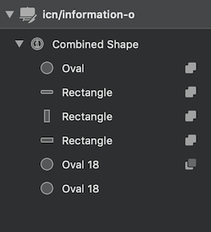
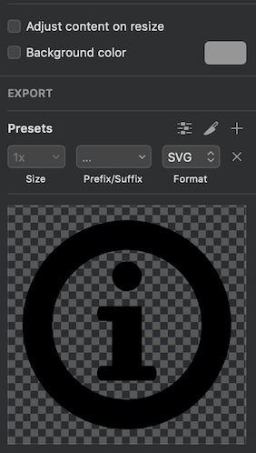

# Gitlab SVG's

Repository to manage all SVG Assets for GitLab. Creates SVG Sprites out of Icons and optimises SVG based Illustrations.

## SVG Online Viewer - [http://gitlab-org.gitlab.io/gitlab-svgs/](http://gitlab-org.gitlab.io/gitlab-svgs/)

## Requirements

You need to have [`yarn`](https://yarnpkg.com/en/) and `node` installed. On a Mac you can install both with `brew install yarn`

On first time, or after updating from master, use `yarn install` to install the latest dependencies.

## Commands

`yarn run svg` - Runs all tasks that are available, if you want to release a new version just run this task

All output is saved to the `dist` folder, from where it is also taken from our main applications.

## Adding icons or illustrations

- Create a new branch in your local copy from `gitlab-svgs`. Make sure that you have the latest master first.

- Make sure that your dependencies are up to date by running `yarn install`

- Export the icons or illustrations you created as SVGs

  - Place icons in the `sprite_icons` folder, see [instructions below on how to properly export an icon](#exporting-icons-from-sketch).
  - Place illustrations in the `illustration` folder

- Make sure [SVGO Compressor Sketch plugin](https://github.com/bohemiancoding/svgo-compressor) is installed (it will compress the SVG automatically) or you can  use [SVGO](https://github.com/svg/svgo) to optimize the SVG after you export.
  ```bash
  # optimize our `huge_test.svg` file
  yarn run svgo ./path/to/huge_test.svg
  ```
- After adding the new svgs, you need to execute the following commands, so that you can verify your changes locally at http://localhost:3333/

  ```bash
  # This will optimize all illustrations and combine the icons into one file
  yarn run svg
  # Starts a local server to preview your changes
  yarn run dev
  ```

- If you are happy with the new/changed SVG, commit and push all changes (including the ones to the `dist` folder) and create an MR.

- Assign the merge request to a maintainer of the `gitlab-svg` project.
  You can find the maintainers on the [GitLab project overview page](https://about.gitlab.com/handbook/engineering/projects#gitlab-svgs).

### Exporting icons from Sketch

1. Confirm that your icon is designed at 14px by 14px and is centered within a 16px by 16px artboard.

1. Make sure your icon has been designed using `#000000` as the only fill color.

1. Double check there are no masks applied to your icon and that you’ve used combined shapes when necessary.

   

1. Make sure there is no background color applied to the Artboard.

   

1. Once exported, view the .svg file and make sure you don't see `</mask>` or any other fill except for `<path fill="#000">` in the file. Otherwise, we cannot change the color of the icon. An exception for this is brand icons for companies or products, which may have specific color requirements. These icons should be named starting with `brand-`, e.g `brand-slack.svg`.

## Preview Application

The application for previewing is based on [NUXT](https://nuxtjs.org/) and is located in the folder `svgpreviewer`.

You can run it locally through `yarn run dev` then it will available under `http://localhost:3333/`.

With `yarn run generate` you can generate the static output to the `public` folder.

## Publishing a new version

Every time a file is added, deleted, modified or renamed within the `sprite_icons` / `illustrations` folders
and the change is merged into master, we automatically publish a new minor version of the package.

## Contributing

GitLab is an open source project and we are very happy to accept community contributions. Please refer to [CONTRIBUTING.md](/CONTRIBUTING.md) for details.
