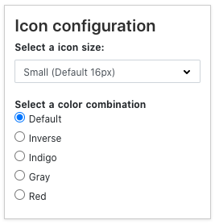

# Gitlab SVGs

This repository manages all SVG Assets for GitLab by creating SVG sprites out of icons, and optimizing SVG illustrations.

## Previewing the SVG library

Visit the [GitLab SVG Previewer](http://gitlab-org.gitlab.io/gitlab-svgs/) website to see, reference, and search through all available icons and illustrations.

## Requirements

- You’ll need [**yarn**](https://yarnpkg.com/en/) and [**node**](https://nodejs.org/en/download/) installed. On a Mac, you can install yarn with `brew install yarn`.
- For the first time, or after updating from the `main` branch, use `yarn install` to install the latest dependencies.

## Commands

`yarn run svg` - Runs all tasks that are available. You can also run this task to release a new version.

All output is saved to the `dist` folder where it’s referenced from our main applications.

## Adding icons or illustrations

- If you're adding a third-party logo or trademark, refer to [this section](#adding-third-party-logos-or-trademarks).
- Review the following documentation:
  - [Iconography design guidelines](https://design.gitlab.com/product-foundations/iconography)
  - [Illustration design guidelines](https://design.gitlab.com/product-foundations/illustration)
  - [Illustration contribution guidelines](https://gitlab.com/gitlab-org/gitlab-svgs/-/blob/main/doc/illustration-contribution.md)
- Make sure you have the latest from the `main` branch in your local copy of the **gitlab-svgs** repository, then create a new local branch.
  ```bash
  # Retrieve the latest updates
  git pull
  # Create a new local branch
  git checkout -b new-branch-name
  ```
- Make sure that your dependencies are up to date by running `yarn install`.
- Export the icons or illustrations as a `.svg` file where:
  - Icons are placed in the `sprite_icons` folder. [Read instructions below on exporting icons](#exporting-icons-from-figma).
  - Illustrations are placed in the `illustrations/` folder. There are subfolders for illustration categories, like empty states or logos.
- If you are not compressing an SVG during export, you can use [SVGO](https://github.com/svg/svgo) to optimize it after you export.
  ```bash
  # Optimize our `huge_test.svg` file
  yarn run svgo ./path/to/huge_test.svg
  ```
- After adding the new SVGs, execute the following commands to verify your changes locally at http://localhost:3333/
  ```bash
   # Starts a local server to preview your changes
   yarn run dev
  ```
- Test icons by changing the settings in the **Icon configuration** panel of the local preview site and ensuring that the icon changes color and size (there are a few icons that intentionally don’t change color).

  

- If you are happy with the new/modified SVG, commit and push all changes (including the ones to the `dist` folder) and create a merge request.
  ```bash
  # After committing your changes, use this to create a remote branch. A link will then be available to create the merge request.
  git push -u origin new-branch-name
  ```
- Assign the merge request to a maintainer of the **GitLab SVGs** project.
  You can find the maintainers on the [GitLab project overview page](https://about.gitlab.com/handbook/engineering/projects#gitlab-svgs).

### Adding third-party logos or trademarks

1. See the [process for adding third-party trademarks to GitLab](https://about.gitlab.com/handbook/legal/policies/third-party-trademark-usage-guidelines/#process-for-adding-third-party-trademarks-to-gitlab) in the handbook.
1. Place approved assets in the `/illustrations/third-party-logos` directory.

### Exporting icons from Figma

Icons should only be exported after they have been added to the Pajamas UI Kit in Figma. This ensures that it’s the final version of the icon that gets exported, and the export settings are retained for developer handoff if it’s ever needed.

1. Confirm that the icon follows the [icon design guidelines](https://design.gitlab.com/product-foundations/iconography).
1. Make sure the parent frame around the icon has no background fill.
1. Select the icon and in the right properties panel add SVG as the export option. This should be done whether or not you are using the Advanced SVG Export plugin. If you want to optimize the icon during export use the following process, otherwise export the icon via the properties panel and skip to the next step.
   1. Install the [Advanced SVG Export](https://www.figma.com/community/plugin/782713260363070260/Advanced-SVG-Export) plugin. The plugin uses [SVGO](https://github.com/svg/svgo) under the hood. Use the default settings.
   1. Select the icon and run the plugin, exporting to the `sprite_icons` folder.
   1. Open the resulting SVG file in your text editor and remove `fill="none"` from the main `<svg>` element.
1. After adding the new SVGs, execute the following commands to verify your changes locally at http://localhost:3333/
   ```bash
   # Starts a local server to preview your changes
   yarn run dev
   ```

Brand icons for companies or products, which may have specific color requirements, should be named starting with `brand-`, for example, `brand-slack.svg`. These icons may have something different than `fill="#000"` to prevent color from being overridden.

## Preview Application

The application for previewing is based on [NUXT](https://nuxtjs.org/) and is located in the folder `svgpreviewer`.

You can run it locally through `yarn run dev` then it will available under `http://localhost:3333/`.

With `yarn run generate` you can generate the static output to the `public` folder.

## Publishing a new version

Every time a file is added, deleted, modified or renamed within the `sprite_icons` or `illustrations` folders and the change is merged into the `main` branch, a new minor version of the package is published.

## Contributing

GitLab is an open source project and we are happy to accept community contributions. Please refer to [CONTRIBUTING.md](/CONTRIBUTING.md) for details.
